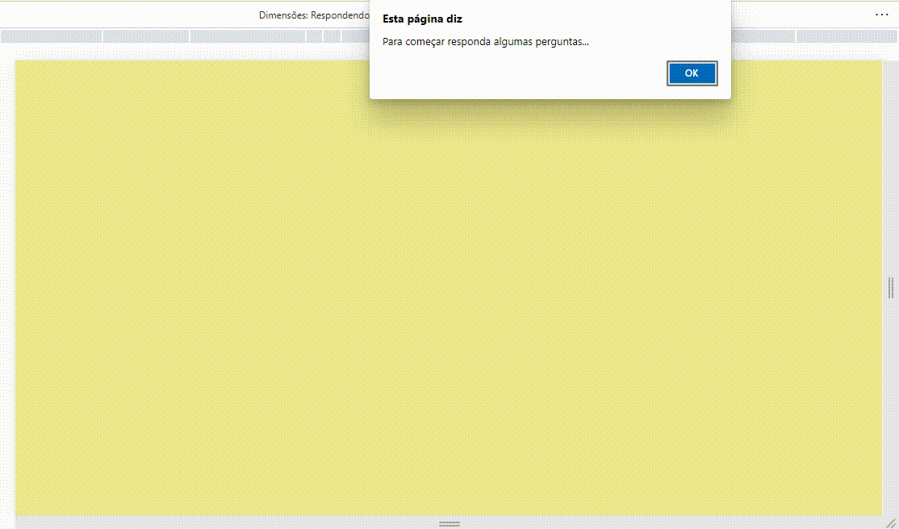

# #7DaysOfCode
> Projetos desenvolvidos no desafio **JavaScript e DOM** do [7DaysOfCode](https://joi-gn.github.io/INSTAGRAMLOGINPAGE-recriando-interface-instagram/).

#### :new moon: 1/7 - Operações Booleanas.   
Tipo e declaração de variáveis.
Estrutura de ramificação if/else.

#### :waxing crescent moon: 2/7 - Variáveis.  

Trabalhar com valores de entrada.
Utilizar console.log, prompt e alert.

#### :first quarter moon:

#### :full moon:

#### :waning gibbous moon:

#### :last quarter moon:

#### :waning crescent moon: